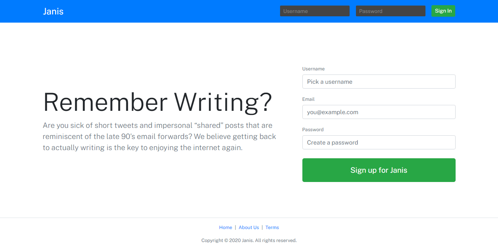

# Blogging Platform

A blogging platform using React Hooks, MongoDB Atlas, Express and Node.js.

## Demo

[See Demo deployed on Netlify](https://react-blogging-platform.netlify.app/)

  

## Core features

- handling routes with React Router.
- connecting the front-end to an Express back-end with a MongoDB Atlas database.
- sending requests to the server with useEffect, Axios and async/await method.
- managing connected users with localStorage.
- combining useReducer and Context to handle global state.
- handling form validation with React hooks and useImmerReducer.
- displaying error/success messages with Context.
- performing CRUD operations (create, read, update, delete) for posts.
- displaying profile with the latest posts published by author.
- handling markdown in posts with react-markdown.
- showing user-friendly messages with react-tooltip.

## Live Search Feature

- handling key press events with useImmer and setTimeout().
- showing/hiding the modal gradually with CSS animations and react-transition-group.
- creating an index in MongoDB Atlas.

## Follow Feature

- handling follow and unfollow features on author profile.
- retrieving followers and followed users from the database.
- showing posts, followers and followed users in tabs with Switch and NavLink.
- displaying a feed on the dashboard with the latest posts published by followed users.

## Live Chat

- handling realtime communication between web clients and server with Socket.IO.
- sending messages with emit() and waiting for messages with on().
- listening to an input field with useRef.
- displaying usernames and avatars in the live chat.

## Live Validation

- displaying errors on the fly for registration form with regex.
- checking if username and email are already taken with useImmerReducer.
- performing a last check before submitting the form.

## Performance

- cleaning useEffect to avoid memory leaks.
- lazy-loading Search and Chat components with Suspense.
- building a HTML pre-render with ReactDOMServer and @babel/node.

## Deployment

- deploying the back-end on Heroku.
- deploying the front-end on Netlify.

Based on [React For The Rest Of Us](https://www.udemy.com/course/react-for-the-rest-of-us/) by Brad Schiff (2020).
